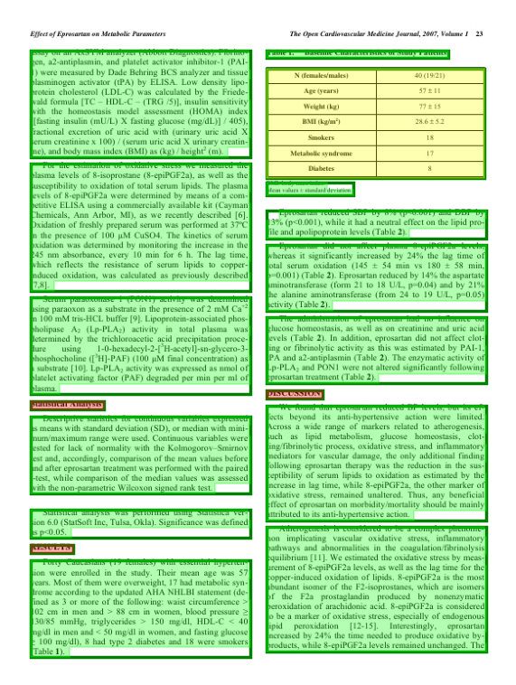

# Document Layout Segmentation

The [Segment Anything model (SAM)](https://github.com/facebookresearch/segment-anything) does a wonderful job at segmenting almost all the images with just zero shot learning. But it is observed that this model does not work well with documents wherein we have <i>objects</i> like figures, tables, lists, and texts. 

It is observed that the model can be finetuned to segment the objects on documents as well. This would result SAM being powerful enough to segment any scenic or natural images as well as documents (thus justifying the name Segment Anything 😉) 


## Requirments: 
It is advised to create a seperate environment for installing the dependencies. 
```
pip install -r requirements.txt
```
Or, alternatively, you can download the yaml file to create a new conda environment:
```
conda env create --file environment.yml
```

## Visualize Annotations
The annotations including bbox and mask can be viewed with the help of ```utils\visualize.py``` script. 

Sample annotation:

